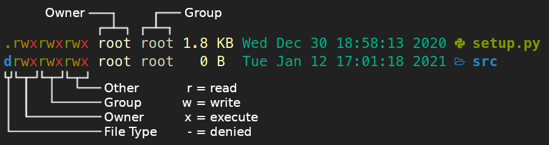

<!-- translation
[English](README.md) | [Tiếng Việt](README-vn.md) -->

# Cheat Sheet - Linux

This is a collection of commands I'm using on my linux machine (Ubuntu 20.04.1 LTS) as a python developer. It is a structured documentation of the commands I'm using throughout interactive shell sessions. Caution, this abstract is highly opinionated :wink:

# Contents

1. [Shell Expansions, Shell Operators](#1-shell-expansions-shell-operators)
   - [Shell Expansions](#shell-expansions)
   - [Shell Operators](#shell-operators)
2. [Built-in Commands](#2-built-in-commands)
   - [Filesystem Navigation](#filesystem-navigation)
   - [Filesystem Exploration](#filesystem-exploration)
   - [Create, Delete, Copy, and Link](#create-delete-copy-and-link)
   - [Working with File Content](#working-with-file-content)
   - [System Updates](#system-updates)
   - [Data Compression](#data-compression)
   - [Ownership and Permissions](#ownership-and-permissions)
   - [Environment Variables](#environment-variables)
   - [Finding patterns: grep, find, sed and awk](#finding-patterns-grep-find-sed-and-awk)
   - [Running Scripts](#running-scripts)
   - [Processes and Jobs](#processes-and-jobs)
3. [Third Party Tools](#3-third-party-tools)
   - [pip and pipenv](#3.1-pip-and-pipenv)
   - [Anaconda](#anaconda)
   - [Git](#git)
   - [Docker](#docker)
   - [Miscellaneous Tools](#miscellaneous-tools)
4. [Aliases and Functions](#4-aliases-and-functions)
5. [Shortcuts](#5-shortcuts)
   - [Ubuntu Desktop](#ubuntu-desktop)
   - [Terminal](#terminal)
   - [Nano Editor](#nano-editor)
   - [Chromium Browser](#chromium-browser)
   - [VSCode](#vscode)
6. [Shell Configuration](#6-shell-configuration)

I use the alias `marcopolo` to reach this cheat sheet faster:

```bash
echo "\nalias marcopolo='xdg-open https://github.com/NiklasTiede/cheatsheet' && exit" >> ~/.zshrc
source ~/.zshrc
```

---

# 1. Shell Expansions, Shell Operators

## Shell Expansions

Expansions are performed by the shell before the command is executed. Tilde and filename expansion are used more frequently when interacting with the shell. Brace, variable and arithmetic expansion tend to be used more often while doing shell scripting.

The tilde `~` expands to the environment variable `$HOME`, which is usually the home directory. If `$HOME` is not defined, tilde `~` expands with the home directory by default.

```bash
$ echo ~
/home/username
```

Filename expansion is a way to select easily a number of files or directories from within the current working directory as arguments for a command. This is accomplished by pattern matching: A so-called glob pattern containing wildcard characters is used to specify the files or directories. The wildcard characters can represent any of the 128 ASCII characters and can be less specific (`*` or `?`) or more specific (`[...]`)

| Wildcard Character | Description                                |
| ------------------ | ------------------------------------------ |
| `*`                | Matches any number of any characters       |
| `?`                | Matches any single character               |
| `[...]`            | Matches any one of the enclosed characters |

Examples:

```bash
$ ls
file1.go  file2.go  file3.py  file4.py  file40.py

$ ls *.py
file3.py  file4.py  file40.py

$ ls file?.py
file3.py  file4.py

$ ls file[0-3].*
file1.go  file2.go  file3.py
```

The lesser known extended globbing (like `*(pattern)`), is used more commonly in shell scipting than in interactive shell sessions. The same applies for brace, variable and arithmetic expansions which are explained within the [Shell Scripting](#shell-scripting) section.

**[⬆ back to top](#contents)**

---

## Shell Operators

Shell operators let you combine commands which expands your toolbelt vastly. They can be divided into two categories: redirection and control operators. Control operators allow for coupling commands.

| Token | Example                  | Description                                 |
| ----- | ------------------------ | ------------------------------------------- |
| `\|`  | `history \| grep "patt"` | Pipelining: direct output of com1 to com2   |
| `&`   | `python myscript.py &`   | start child process (execute in background) |
| `&&`  | `com1 && com2`           | Execute com2 only if com1 is executed       |
| `;`   | `com1; com2`             | Execute both commands always                |

Especially the pipe operator `|` here shines. Any output printed by command1 is passed as input to command2.

Examples:

```bash
$ ls | head -3

$ cat filename | grep 'pattern'
```

---

Whereas redirection operators direct the output of a command to another command.

| Token        | Example                           | Description                                      |
| ------------ | --------------------------------- | ------------------------------------------------ |
| `>` or `<`   | `echo '#projectname' > README.md` | Direct output of com1 to com2 or vice versa      |
| `>>` or `<<` | `echo 'source x' >> ~/.bashrc`    | append output                                    |
| `>&`         | `./script.py > script.out 2>&1`   | Redirect both standard error and standard output |

Examples:

```bash
$ echo 'alias=' >> ~/.zshrc

$ more good examples
```

These operators and shell expansions will be found throughout this cheat sheet repeatedly.

**[⬆ back to top](#contents)**

---

# 2. Built-in Commands

Linux distributions contain a plethora of powerful built-in commands. The presented commands are sorted by topic. If you're not aware of a commands capabilities you can add the `--help` or `-h` flag to display all options. The `--version` or `-v` flag returns the version number and is commonly used right after installation to check a programs version.

```bash
<command> --help
<command> --version
```

## Filesystem Navigation

Navigation on the file system is the first step towards learning how to utilize the power of a Linux system. Notice: <kbd>Tab</kbd> enables auto completion of file-/dirnames and saves valuable time!

```bash
ls                # list content of current working dir
ls -la            # Display all files and extended file metadata
ls -la *.py       # Lists only python files

cd <directory>    # change directory
cd ..             # goes on folder up

pwd               # print working directory
date              # to navigate yourself also in time ;-)

xdg-open .        # opens the Nautilus file manager
gnome-terminal    # open a terinal window from within a terminal
```

Since most people (like me) don't have a photographic memory, it's always a good choice to use the machines memory.

```bash

history           # prints a list of all historically used commands
history | tail    # prints 10 recently used commands

clear             # clears the terminal
```

Pressing arrow keys <kbd>Up</kbd> <kbd>Down</kbd> or <kbd>Ctrl</kbd> <kbd>R</kbd> (search bar) is my preferred choice. BTW: I geared the shell towards my needs (see [configuration](#configuration)) so everything looks pretty satisfying.

**[⬆ back to top](#contents)**

---

## Filesystem Exploration

Wanna get more information about a commands features? Look into the manual pages or use `whatis` if time is tight. `which` can clear things up about a commands origin on the filesystem.

```bash

man <command>           # shows a manual (man pages)
whatis <command>        # returns a one-line description

which <command>         # returns path to the programs binary
file *                  # lists the types of all files

type <command>          # discriminates between built-in and 3rd party tools
```

File space estimation:

```bash

sudo du -sh <file/dir>  # shows size of specified file/dir
sudo du -sh *           # shows the size of all files/folders
df -h                   # shows all memory usage on filesystem
```

**[⬆ back to top](#contents)**

---

## Create, Delete, Copy, and Link

Some basic operations when working with files and directories.

```bash

touch <file>            # creates an empty file

rm <file_name>          # removes a file
rm -rf                  # forces to remove a directory with content recursively

mkdir <dir_name>        # create directory
mkdir -p a/b/c          # creates a directory tree
mkdir file{1..5}        # creates 5 enumrated files

rmdir <dir_name>        # removes a directory
```

Files and directories can be copied or linked. Hard links point to the files in memory directly whereas soft links point to the file which references to the place in memory.

```bash

cp <file> <path/new_filename>  # copies a file to the advised path
cp -R <source> <destination>   # copies recursively

ln <target> <new_link>         # creates a hard link to a file
ln -s <target> <new_link>      # creates a soft link to a file
rm <new_link>                  # removes the symlink
```

**[⬆ back to top](#contents)**

---

## Working with File Content

There are several commands to see the content of a file without opening it with an editor.

```bash

head <file>       # prints the first 10 lines of a file
head -n 5 <file>  # prints the first 5 lines
tail <file>       # shows last 10 lines
cat <file>        # prints content of a file

wc <file>         # word count, returns number of lines, words and characters
```

When changing the content of a file, it's best to use an editor. Nano is an into the terminal integrated file editor. I'm using it when surfing between files and making minor changes. For writing bigger pieces of code I'm using VSCode as my IDE. Efficiency of editing is improved by usage of [shortcuts](#shortcuts).

```bash

nano <file>      # opens the file (nano is a terminal application for text editing)
code <file>      # open file in VSCode
```

**[⬆ back to top](#contents)**

---

## System Updates

Always keep your system up to date :wink:

```bash

sudo apt update
sudo apt upgrade
sudo apt autoremove
```

sudo gives super user privileges temporarily. `su` lets you switch to super user (root) and back.

```bash
sudo !!            # runs previous command as sudo
sudo su            # switchs to root user
su <username>      # switchs back to the user account
```

Some commands to turn local/remote systems on/off.

```bash

sudo reboot        # reboots system
sudo poweroff      # powers system off
logout             # logout from current users session
```

Hibernate and suspend are useful for desktop distributions of linux to save energy. But this can interrupt running scripts. So turn automatic suspension off (`Settings` -> `Power` -> `Automatic Suspend`). On the other hand it's also a nice idea to run your scripts remotely (x86 server or your own Raspberry Pi).

**[⬆ back to top](#contents)**

---

## Data Compression

Compression is always a space-time complexity tradeoff. On linux systems many files are collected usually into one archive file, referred to as a tarball. `tar` is the tool of choice for compression and decompression.

```bash
tar -ztvf filename.tar.gz         # list content

tar -zxvf filename.tar.gz         # decompression
tar -zxvf filename.tar.gz <path>  # decompressed into target  folder

tar -cvzf filename.tar.gz <path>   # compression of a folder, returns filename.tar.gz
```

**[⬆ back to top](#contents)**

---

## Ownership and Permissions

Linux is a multi-user OS and therefore implements concepts like users and groups to ensure proper security. There are 3 types of owners:

- **User** | _A user is the one who created the file._
- **Group** | _A group can contain multiple users sharing the same permissions. By default the group is the same as the user._
- **Other** | _Any one who has access to the file other than user and group falls int this category. Other has neither created the file nor is a group member._

Each files/dirs access mode can be displayed when using the `ls -l` command. Each filessytem entry can have read, write and execute permissions.

<p align="center">
  <a href="https://the-coding-lab.com" alt="My-Blog" >
    
  </a>
</p>

The access modes (Owner, Group, Other below image) can be modified using the `chmod` command. I prefer to use the octal notation over the symbolic notation when changing permissions.

```bash
chmod <octal> <file/dir>  # change permissions of a file/dir

chmod 777 <file/dir>      # full permissions
chmod 644 <file/dir>      # default permissions when creating new file

chmod +x <script.sh>      # makes a script executable
chmod -R 755 <path>       # changes permissions recursively
```

The following table displays the octal notation and it's representation.

| Octal Notation | Symbolic Repr | Permissions             |
| -------------- | ------------- | ----------------------- |
| 0              | ---           | No permissions          |
| 1              | --x           | Execute only            |
| 2              | -w-           | Write only              |
| 3              | -wx           | Write and execute       |
| 4              | r--           | Read only               |
| 5              | r-x           | Read and execute        |
| 6              | rw-           | Read and write          |
| 7              | rwx           | Read, write and execute |

To modify ownership (Owner and Group above image) `chown` is used.

```bash

chown user:group <file/dir>  # changes the ownership
```

**[⬆ back to top](#contents)**

---

## Environment Variables

Environment variables are key-value pairs on the system that can be retrieved by applications. They're used to ensure separation of concerns. Important default Environment variables are `$HOME`, `$SHELL` and `$PATH`. HOME defines the systems home directory. PATH tells the shell which directories to search for executable files. Multiple values assigned to a variable must be separated by a colon `:`. By convention, environment variables should have UPPER CASE names.

```bash
printenv           # prints all environment variables
printenv HOME      # prints the value of a specified env var
echo $HOME         # same as above
```

For instance credentials can be separated from code as environment variables (or within files). The creation of new env vars can be achieved by the `export` command. To set a env var for the current user permanently it has to be appended to your .bashrc or .zshrc file.

```bash

export VARNAME="value"                         # set in current shell
echo 'export VARNAME="value"' >> ~/.bashrc     # set permanently in all bash sessions
sudo -H nano /etc/environment                  # set system wide, no export-keyword used
```

**[⬆ back to top](#contents)**

---

## Finding Patterns: grep, sed and find

Several tools to search for files and file-content exist. This can speed up things. `grep` prints lines matching a pattern. The table below shows some important flags I use on a daily basis.

| Flag        | Description                 |
| ----------- | --------------------------- |
| `-r`        | Recursive                   |
| `-l`        | Only filenames              |
| `-n`        | Number of line within file  |
| `-w`        | Only whole words            |
| `--include` | Only certain files included |

Sometimes I search through a folder of files for a pattern. For replacing the pattern, `sed` can be used. When I refactor code I prefer use VSCode's search-and-replace capabilities. Most commonly I use `grep -rnw 'patt' .` to know how much times the pattern is reoccuring.

```bash
grep -rnw 'patt' .               # searchs through cwd for pattern

grep -rl 'patt' .                # print names of files containing pattern

grep -rnw 'patt' --include=*.py  # searches only specified files for pattern
```

---

sed is a stream editor for filtering and transforming text. `tail` and `head` return top and bottom of a file. Wanna see parts in the middle? Use `sed`!

```bash

sed -n '5,10p' <file>    # returns line 5 to 10
```

It's also useful for replacing patterns within one or more files.

```bash

sed -i 's/foo/bar/g' *    # replace pattern (foo) by bar in multiple files
```

---

`find` searchs for files in a directory hierarchy.

```bash

find . -name <file>           # prints all filenames containg the exact pattern

find . -type f -name "*.py"   # prints rel. path of specified files
```

When pipelining these commands you can be pretty creative. For instance if you would like to see your 10 most used commands, then try this:

```bash

history | sed -e 's/ *[0-9][0-9]* *//' | sort | uniq -c | sort -rn | head -10
```

**[⬆ back to top](#contents)**

---

## Running Scripts

add python path to the script file as shebang line

if the script imports only standard lib packages, no venv is required
if script is simple and no 3rd party packages are required or a specific python version (script is executeable on global python version) you dont need to use a virtual env, and instead use your shells default python version

```bash
which python
python myscript.py   # no shebang line
```

if the script is more complex and/or needs another python interpreter, then you have to add a shebang line from the virtual anv. I use pipenv or anaconda
example: webscraping using 3rd party packages like requests, biautifulsoup etc.

```bash
./myscript.py    # contains shebang line
use python interpreter in isolated env
conda activate env
pipenv shell
which python # use path for creating shebang line

```

pipenv environment

```python
#!/home/niklas/.local/share/virtualenvs/test_pipenv-KVowtm2h/bin/python   # pipenv environment
or
#!/home/niklas/anaconda3/envs/my_env/bin/python # anaconda envirnment
```

If you have a useful script you wanna use more easily, then make an alias!

```bash
alias name='~/MyScripts/myscript.py &'
```

text

**[⬆ back to top](#contents)**

---

## Processes and Jobs

Python makes it easy to automate processes by just writing and running it. But how to we achive this without having to let a terminal opened? Using ampersand `&` and `nohup`! The Amperesend sends the process in the background and nohup assures that the process continues even if you're logged out from the current shell session. `jobs` will show you each of these running processes.

```bash

<command> &                   # executes command in the background
nohup <command> &             # command is executed even if shell session ends

nohup python myscript.py &    # examples
nohup ./myscript.py           # script is executable and has shebang line

./script.py > script.out 2>&1 # redirect stdout/stderr into script.out file

jobs                       # shows each running job
```

If your script prints messages to the terminal and you want to save the output in a file: use the `tee` command! It will redirect the script output also to a file. And if you'd like to continue working within the shell redirect the terminal output to /dev/null.

```bash

tee                                                      # read from stdin and writes to stdout and a file
tee -a                                                   # append
./myscript.py | tee ~/myscript_output.txt &              # save script output
./myscript.py | tee ~/myscript_output.txt > /dev/null &  # and continue working within shell
```

---

But when starting a process it's always nice to know how to stop it. So how do we locate processes in linux and kill it? `ps aux` is your freind for listing all running processes.

```bash

ps aux                   # list of all processes
ps aux | grep 'program'  # find a process and it's ID (PID)
pgrep 'program'          # returns only the PID

pstree                   # shows processes as tree

kill <SIGNAL> <PID>      # killing a process
killall -9 firefox       # if the exact name of the process is known
```

Depending on the signal value you can kill the process (value 9) or do other things.

| Signal Name | Value      | Effect                  |
| ----------- | ---------- | ----------------------- |
| SIGHUP      | 1          | Hangup                  |
| SIGINT      | 2          | Interrupt from keyboard |
| SIGKILL     | 9          | Kill signal             |
| SIGTERM     | 15         | Termination signal      |
| SIGSTOP     | 17, 19, 23 | Stop the process        |

BTW: there are some interesting 3rd party tools to monitor your system (see [](#))

## Cron Jobs

Cron daemon is a built-in Linux utility that runs processes on your system at a scheduled time. Cron reads the crontab (cron tables) for predefined commands and scripts. So if you want to execute certain scripts repeatedly, then doing cron jobs is your friend. Add a new line with specified values to the crontab.

```bash
crontab -l                                  # List all running cronjobs
crontab –e                                  # Setting up a new cronjob

a b c d e </directory/command> output       # Standard format for a crontab line
* * * * * directory/command >/dev/null 2>&1 # output redirected to dev/null
```

The fields `a` to `e` are used to set up the time at which the script is triggered. Furthermore, you have to specifiy the scripts path.

| Field           | Possible Values | Syntax        | Description                |
| --------------- | --------------- | ------------- | -------------------------- |
| a - min         | 0 - 59          | 7 \* \* \* \* | Every 7th min              |
| b - hour        | 0 - 23          | 0 7 \* \* \*  | Every 7 am                 |
| c - day         | 0 - 31          | 0 0 7 \* \*   | Every 7th day of the month |
| d - month       | 1 - 12          | 0 0 0 7 \*    | Every july                 |
| e - day of week | 1 - 7           | 0 0 \* \* 7   | Every sunday               |

The output of the job can be send to an email address when configured. It's also possible to send emails from within your scripts. Alternatively you can redirect the output to a log-file or to `/dev/null`.

```bash

* * * * * ~/myscript.py                     # runs every minute
0 8,17 * * * ~/send_reminder_mail.py        # runs at 8 and 17 o'clock
* 0,11 * * * ~/webscraping.py               # runs every 12 hours
* 0 * * * ~/webscr.py >> ~/webscr.out 2>&1  # redirect output to logfile
10 0 * * * ~/neural_network.py              # runs every night at 00:10 a.m.
50 0 * * 2 ~/backup.sh                      # runs every tuesday at 00:50 a.m.
```

**[⬆ back to top](#contents)**

---

# 3. Third Party Tools

Before we can benefit from any 3rd party tool, we have to install these using a package management system. Linux distributions have different package managers to handle dependencies. I'm using Ubuntu 20.04 LTS so `apt` (Advanced Package Tool), `snap` and `homebrew` are my package managers of choice.

```bash

apt search <package>*      # search for package
apt show <package>         # shows package details
apt install <package>      # installing package
apt remove <package>       # removing package
apt list                   # lists all packages

snap find <package>
snap info <package>
snap install <package>
snap remove <package>
snap list

brew search <package>
brew info <package>
brew install <package>
brew uninstall <package>
brew list
```

For managing python packages pip and conda are two quite popular package managers.

## 3.1 pip and pipenv

pip is a package-management system used to install and manage python packages. It's repositories can be found at [pypi.org](https://pypi.org/).

```bash

pip search <package>            # search pypi
pip install <package>           # installing a package from pypi
pip uninstall <package>         # uninstalls specified package
pip list                        # lists all pip-packages within the current env
pip freeze > requirements.txt   # saves all package-versions of current env
```

The package dependencies of each python project should be managed with care. Therefore using an isolated virtual environment for each project is best practice. pipenv is a nice dependency manager. If you want to see how to run scripts which depend on 3rd party packages see section [Running Scripts](#running-scripts).

```bash

pipenv --python 3.8                 # creates new env with pandas
pipenv install numpy                # install package (I prefer pip install)
pipenv shell                        # activate environment
exit                                # deactivates the venv
pipenv --rm                         # removes the venv (not the pipfile)
pipenv install -r requirements.txt  # builds env up from an requirements file
pipenv graph                        # shows packages and their dependencies
pipenv --py                         # returns path to python version
```

setup.py file

```bash
pip install .           # install package from stup.py file
pip install -e .       # package is installed and you can work on it at the same time
```

How to upload packages to [pypi.org](). A `setup.py` file is created, populated and used to generate files which are uploaded to pypi.

```bash

```

Some packages can only be found at the repository of Anaconda.

**[⬆ back to top](#contents)**

---

## 3.2&nbsp; Anaconda

pip and pipenv are focused around Python, neglecting non-Python library dependencies. This is where Anaconda starts to shine. It is a language-agnostic cross-platform environment manager simplifying the package management of non-python libraries. It's main audience is the scientific community.

How to retrieve information about anaconda, your environments and configurations.

```bash
conda info                                         # gives information about version, envs
conda env list                                     # shows all environments

conda update -n base conda                         # updates conda
conda clean -h                                     # cleans download cache ('pkgs'-folder)
```

How to create new environments, activate them and install packages.

```bash
conda create --name <env_name> python=3.8          # creating conda env with specific python-version

conda create -n <env_name> python=3.9 rdkit        # creating conda env with specific package
conda install -c rdkit rdkit-postgresql            # installing PostgreSQL as client for rdkit-postgreSQL cartridge
conda activate <env_name>                          # activates conda env
conda deactivate                                   # deactivates current conda env
```

How to list packages and remove them.

```bash
conda list                                         # lists all packages/versions of the active conda env
conda list --name <env_name>                       # lists all packages of a certain conda env
conda list --revisions                             # lists all revisions made in active conda env
conda remove --name <package_name>                 # deletes a specified list of packages from spec. conda env
conda env remove --name <env_name>                 # deletes an specified environment
```

How to share environments (export to/create from YAML-file). `pip` stores dependencies within a `requirements.txt` file.

```bash
conda create --clone <env_name> --name <new_env>   # make copy of an env

conda env export --name <env_name> > <envname.yml> # export env to YAML file

conda env create --file envname.yml                # creates env from YAML file
conda env create                                   # shorter: creates env from the file named environment.yml in cwd

conda list --explicit > pkgs.txt                   # export env with exact package versions for one OS (the URLs)
conda create --name <new_env> --file pkgs.txt      # create env based on exact package versions
```

How channels work, managing anaconda.

```bash
# using packages and channels
anaconda-navigator                                 # opens the anaconda navigator
anaconda search <package_name>                     # search for a package on all channels (not only default chan)
conda install conda-forge::<package_name>          # installs a package from a specific channel
conda config --add channels <channel_name>         # add a channel to your conda configuration (conda-forge)

# manage anaconda account
conda install anaconda-client                      #
anaconda -h                                        #

conda update --all --name <env_name>               # updates all packages within a specified env
conda config --show                                # shows all configurations
```

How to upload packages. Packaging with conda can be done by setting a meta.yml file. Then `conda build` builds the package with the specified python version. the file can be found within the `conda-bld` folder within the environment. You can upload it on your channel and everyone can easily download your package and it's dependencies.

```bash

conda build --py 3.8 recipe .
conda install conda-build

anaconda upload /home/niklas/anaconda3/envs/feedingORCAs/conda-bld/linux-64/feedingorcas-0.1.0-py39_0.tar.bz2
conda install -c niklastiede feedingorcas
anaconda login                                     #
anaconda upload PACKAGE                            #
https://<your-anaconda-repo>/USERNAME/PACKAGE      #
anaconda download USERNAME/PACKAGE                 #

https://<your-anaconda-repo>/USERNAME/PACKAGE
```

**[⬆ back to top](#contents)**

---

## Git

A version control system (VCS) like git is a developers lab notebook. Don't forget that making good commit messages and doin' work bit by bit is of uttermost importance. Connecting a newly created local repository with a remote repository is easy. Go to [github.com](https://github.com/), create a new repo and add it's URL to the local repo by entering the following commands:

```bash
echo "# projectname" >> README.md
git init
git add README.md
git commit -m "first commit"
git branch -M main
git remote add origin https://github.com/NiklasTiede/projectname.git
git push -u origin main
```

Exploring other peoples projects is easy. Clone it and build its dependencies to run it properly. Python projects which contain a setup.py file or a conda.yml can be installed without cond/pip just by downloading it via git

```bash
git clone <https://name-of-the-repository>   # download repo into cwd


```

Here's a normal workflow when making commits on a project:

```bash
git status                          # status information (optional)
git diff                            # difference to last commit (optional)
git add <file1> <newfile2>          # adds new/changed files to staging area
git commit -m 'descr. of commit'    # commit files to the local repo
git push                            # pushs commit t
```

If your would like to look at your work you've done use these:

```bash
git status                 # returns state of working dir and staging area
git diff                   # view changes you haven't committed yet

git log                    # to see what you've done so far
git log -n3                # to see the last few commits you've made
git log --stat --summary   # a complete overview
```

When working on a more sophisticated project, you separate your work (adding features/bug-fixes) from the production-ready main branch by switching to a branch which is named according to it's pupose (like fix-readme-typo). You commit changes and push it to the remote repo. If you're the owner of the repo, you can decide to merge it into your production-ready main branch on your own. If the owner of the project is someone else, you push it and make a pull request. Usually merging bug-fix/feature-branches into the main branch is associated with semantic versioning.

When working solo on a project I create branches, push them to the remote repo to save them and merge them later locally into the main branch. Then I delete the local and remote side branch. This gives you a nice history at hand about how you work.

```bash
git checkout -b <new-branch>           # create new branch
git branch --list                      # list all branches
git push --set-upstream origin <new-branch>

loop:
   [make changes to project]
   git add <file>
   git commit -m 'message'
   git push                            # save a copy of the branch remotely

git checkout main                      # switch to main-branch
git merge <new-branch>                 # merge <new-branch> into main-branch
git push                               # push local into remote main
git branch -d <new-branch>             # delete local <new-branch>
git push origin --delete <new-branch>  # delete remote <new-branch>
```

Pull requests are the way to contribute on Github. It's workflow is: fork -> clone -> edit -> pull request.

```bash
on Github:
   - fork the repository

git clone <https://github.com/your-profile/repo-fork.git>
cd <repo-fork>
git checkout -b <branch-name>            # create a new branch

loop:
   [make changes to the project]
   git status
   git diff
   git add <file>
   git commit -m 'message'
   git push origin <branch-name>

on Github:
   - create pull request                   # add description and title
```

A `.gitignore` file specifies intentionally untracked files that Git should ignore. But if a file was already indexed, how do we remove this file from the index? Add the filename to the `.gitignore` file and then type:

```bash
git rm -r --cached .         # untracks all files which are within .gitignore

git add .
git commit -m 'Removing ignored files'
git push
```

Git can be configured globally and locally. The `.gifconfig` file is the way to go.

```bash
git config --global user.email "my@emailaddress.com"
git config --global user.name "first_name last_name"
```

packages and their dependencies can be installed by pip and conda, but it's also possible to built and install a project on your own by using git:

```bash
git clone git:...
```

**[⬆ back to top](#contents)**

---

## Docker

Containerizing applications is an incredible important part when deploying an application. Docker as containerization technology does the job. It improves an applications portability and scalability by abstracting away the underlying operating system. Thus developing your application within a docker container is common practice. It's just incredible valuable!

This awesome [cheatsheet](https://github.com/wsargent/docker-cheat-sheet) helps me very much. I still got alot to learn so I'm visiting their repo now and then.

```bash
docker info                     # information about docker
docker search <image-name>      # search for image in docker registry
sudo docker pull busybox        # pulling a pre-built image (ID or name?)
docker run <cont-ID>

docker stop <cont-ID>
docker restart <cont-ID>

docker stop <cont-ID>
docker rm <cont-ID>

docker history <cont-ID>        # history of the images

docker commit <cont-ID> <name>  # save the state of the container as image
docker push <cont-ID>           #  push image to registry

docker container ls             # displays all running container
docker image ls                 # displays all docker images
```

working from within an image (using the shell):

```bash
docker exec -it <ID> bash       #
# enter database withitn a container
docker-compose exec db psql -h localhost -U postgres --dbname=postgres
```

build an image -> make a dockerfile and run:

```bash
docker build -t myimage:1.0 .   # build image from dockerfile
```

but first you have to create a dockerfile, which will give docker the specifications of your new docker image!

Dockerfile: instructions to build an image

```dockerfile
FROM python:3.8.1-alpine  # indicates base image
WORKDIR /backend
ENV PYTHONDONTWRITEBYTECODE 1
ENV PYTHONBUFFERED 1
COPY ./requirements.txt /backend/requirements.txt
RUN
CMD
```

if your applications needs multiple container (your app needs a db container) then u need `docker compose`.
text

```bash
docker-compose up --build       #
docker-compose up               #

docker image rm 53efefffaa70   # deletes a specified image
docker rmi $(docker images -q) -f   # delete ALL docker container
```

docker-compose.yml: docker compose is a tool for defining and running multi-container Docker applications

```dockerfile
version: "3.7"
services:
  server:
    build:
      context: ./backend
      dockerfile: Dockerfile
    volumes:
      - ./backend/:/backend/
      - /var/run/docker.sock:/var/run/docker.sock
    command: uvicorn app.api.server:app --reload --workers 1 --host 0.0.0.0 --port 8000
    env_file:
      - ./backend/.env
    ports:
      - 8000:8000
    depends_on:
      - db

  db:
    image: postgres:12.1-alpine
    volumes:
      - postgres_data:/var/lib/postgresql/data/
    env_file:
      - ./backend/.env
    ports:
      - 5432:5432

volumes:
  postgres_data:
```

kubernetes manages containerized applications across multiple hosts.

**[⬆ back to top](#contents)**

---

## Miscellaneous Tools

There's a plethora of smaller command line tools I use. I

### locate

`find` is not fast enough to search for a pattern on the whole system. Locate caches the systems filesnames within a database and searchs the database. The database is regenerated once a week. Optionally you can update is manually by using `updatedb`.

```bash
locate <pattern>       # searches for pattern on system
sudo updatedb          # updates the database used by locate
```

---

### tree

`tree` gives you a nice tree-like overview about a directories content. The `-a` flag includes also hidden files and the `-f` flag displays each file/folders full path.

```bash
tree              # tree of cwd
tree -a           # dotfiles are also shown
tree -f           # full path
tree -L 2         # max depth is set to 2
```

---

### Fuzzyfinder

The fuzzyfinder improves when searching for a path or within your command history. I don't harness it's pull power currently. So I should keep learning this tool!

```bash
fzf                  # search for path
```

---

### HTTPie

[HTTPie](https://github.com/httpie/httpie) is designed for testing, debugging, and generally interacting with APIs & HTTP servers. I use it mainly for testing and exploring API's.

```bash

http <url>     # returns response header/body
flags:
    -h   # returns only the header
    -b   # returns only the body
    -d   # download
    -F   # following redirects
```

You can easily test API endpoints which are served on your local machine. Instead of JSON which is not well suited for command line Httpie allows to write key-value pairs like this:

```bash
http GET localhost:5000/recipes      # GET request

http POST localhost:5000/recipes \   # POST request
name=Soup \
description="Asian soups are the best!"
```

predic8 provides a free testing API:

```bash
http POST https://api.predic8.de/shop/products/ \      # Post
category=Fruits \
name=MyFruit \
price=0.89 \
vendor=672

http -b GET https://api.predic8.de/shop/products/148   # get
```

I Added `"--style=monokai"` to Httpie's default options (`.httpie/config.json`) to get a nicely colored output.

---

### Openssl

Is a genereal-purpose cryptography library. I'm using it only for generating passwords.

```bash
openssl rand -hex 30     # generate hexadecimal key, 30 characters long
```

---

### Glances

[Glances](https://github.com/nicolargo/glances) is a monitoring tool which aims to present a large amount of monitoring information.

```bash
glances
```

---

### tlp

A tool to optimize laptop battery life.

```bash
sudo tlp-stat -s      # system information
sudo tlp-stat -d      # disk information
watch tlp-stat -t     # returns your CPU temperature every 2s
```

---

### Tokei

Tokei is a static code analysis tool. It counts the number of lines code of each file within a selected directory. I use it to get a rough idea of how big a project is and which languages are included. Tokei itself is written in Rust, so it's blazing fast.

```bash
tokei <dir>         # counts the number of lines code per language recursively
```

---

### bpython

A fancier interface than the normal python interpreter. It has syntax highlighting and autocomplete. It will definitly enhance your REPL sessions experience.

```bash
bpython
```

---

### Jupyter Lab

I have a background in chemistry, so Python and data science tasks are a natural fit to me. Jupyter notebooks took data science collaboration to another level. Notebooks enable us to share how a set of data is processed and then used for modeling. [Kaggle](https://www.kaggle.com/) is the best place to get a plethora of interesting data sets.

```bash
conda install jupyter lab
jupyter lab                   # starts a jupyter lab server
```

A lot of extensions are available to customize jupyter lab.

---

### Cookiecutter

Setting up a python project can be time-consuming. Cookiecutter speeds this process up. The templating engine Jinja2 is used by cookiecutter. You select a cookiecutter project template you like (search at github `search?q=cookiecutter+YourSearch`) and use its github URL. Then you're entering your settings of choice and voilà: your projects is good to go!

```bash

cookiecutter <git-URL>                                    # base command
cookiecutter https://github.com/Buuntu/fastapi-react.git  # example: fastAPI-react app
```

As you can see cookiecutter is not only used for python projects but for other languages as well!

---

### Black

Linting tools increase readability and give your project a consistent style. Black is a more common linting tool for python. But there are also others tools like Yapf, flake etc. Some linting tools are only code formatter (like black), some give you also some introspection in your code and can help fixing potential bugs.

```bash
black <file.py>           # linting performed on file.py
```

---

### Spasco

And of course I should not forget to mention [Spasco](https://github.com/NiklasTiede/Spasco) a renaming tool written by myself. :wink: It is listed at the Python Packaging Index (PyPI) and can speed your renaming operations up. By default it replaces all whitespaces of file/directory names by underscores to diminish problems which can sometimes occur with whitesspaces in names.

```console
❯ ls
test dir
test file

❯ spasco
2 files/directories can be renamed:
before             after
'test dir'  --> 'test_dir'
'test file' --> 'test_file'
OK to proceed with renaming? [y/n] y

❯ ls
test_dir
test_file
```

Furthermore, `spasco` lets you customize the search-value (default: whitespaces) and the new-value (default: underscores). All renaming operations can be logged, to ensure that a renaming operation doesn't break things.

**[⬆ back to top](#contents)**

---

# 4. Aliases and Functions

For aliases and funtions you can also explore my [dotfiles](https://github.com/NiklasTiede/Dotfiles).

Aliases save time and work wonders on lengthy commands. Here's a list of my aliases.

```bash
alias name="command flags"


unalias lc

# list all commands
echo -n $PATH | xargs -d : -I {} find {} -maxdepth 1 \
        -executable -type f -printf '%P\n' | sort -u
# list all aliases:
ALIASES=`alias | cut -d '=' -f 1`
    echo "$COMMANDS"$'\n'"$ALIASES" | sort -u


```

**[⬆ back to top](#contents)**

---

# 5. Shortcuts

linux desktop, terminal, nano-editor, chromium, VSCode

Linux shortcuts (desktop)

| Shortcut                                                        | Effect                                   |
| --------------------------------------------------------------- | ---------------------------------------- |
| <kbd>Print</kbd>                                                | Screenshot of entire screen              |
| <kbd>alt</kbd> <kbd>Print</kbd>                                 | Screenshot of current window/application |
| <kbd>Shift</kbd> <kbd>Print</kbd>                               | Screenshot of selected area              |
| <kbd>Super Key</kbd>                                            | Opens Activities search                  |
| <kbd>Ctrl</kbd> <kbd>Alt</kbd> <kbd>Up</kbd> or <kbd>Down</kbd> | Move between workspaces                  |
| <kbd>Super Key</kbd> <kbd>L</kbd>                               | Lock screen                              |
| <kbd>Ctrl</kbd> <kbd>Alt</kbd> <kbd>T</kbd>                     | Open terminal                            |
| <kbd>Ctrl</kbd> <kbd>Shift</kbd> <kbd>Q</kbd>                   | Close terminal                           |

Terminal Shortcuts

| Shortcut                                                          | Effect                                        |
| ----------------------------------------------------------------- | --------------------------------------------- |
| <kbd>Tab</kbd>                                                    | Autocomplete, navigation                      |
| <kbd>Ctrl</kbd> <kbd>Shift</kbd> <kbd>up</kbd> or <kbd>down</kbd> | Scrolling up or down                          |
| <kbd>Ctrl</kbd> <kbd>R</kbd>                                      | Search history bar                            |
| <kbd>Ctrl</kbd> <kbd>C</kbd>                                      | Abort current running process                 |
| <kbd>Ctrl</kbd> <kbd>D</kbd>                                      | Log out of current shell (SQL, Mongo, Python) |
| <kbd>Ctrl</kbd> <kbd>L</kbd>                                      | Clear terminal                                |
| <kbd>Ctrl</kbd> <kbd>U</kbd>                                      | Erase current line                            |
| <kbd>Ctrl</kbd> <kbd>A</kbd>                                      | Move cursor to beginning of line              |
| <kbd>Ctrl</kbd> <kbd>E</kbd>                                      | Move cursor to end of line                    |
| <kbd>Ctrl</kbd> <kbd>left</kbd> or <kbd>right</kbd>               | Move cursor to next word                      |
| <kbd>Alt</kbd> <kbd>D</kbd>                                       | Delete all characters after the cursor        |

nano editor

```bash

nano <file>      # opens the file (nano is a terminal application for text editing)
```

| Shortcut                                             | Effect             |
| ---------------------------------------------------- | ------------------ |
| <kbd>Ctrl</kbd> <kbd>O</kbd>                         | Save file          |
| <kbd>Ctrl</kbd> <kbd>X</kbd>                         | Exit               |
| <kbd>Ctrl</kbd> <kbd>W</kbd>                         | Search for pattern |
| <kbd>Shift</kbd> <kbd>right</kbd> or <kbd>left</kbd> | Select             |
| <kbd>Ctrl</kbd> <kbd>K</kbd>                         | Cut                |
| <kbd>Ctrl</kbd> <kbd>U</kbd>                         | Paste              |
| <kbd>Ctrl</kbd> <kbd>\</kbd>                         | Replace pattern    |

Chromium Shortcuts

| Shortcut                                           | Effect                                   |
| -------------------------------------------------- | ---------------------------------------- |
| <kbd>Ctrl</kbd> <kbd>Shift</kbd> <kbd>T</kbd>      | Reopens recently closed tabs             |
| <kbd>alt</kbd> <kbd>left</kbd> or <kbd>right</kbd> | Moves one page back/forward              |
| <kbd>Ctrl</kbd> <kbd>+</kbd> or <kbd>-</kbd>       | Zoom in, out                             |
| <kbd>Ctrl</kbd> <kbd>Tab</kbd>                     | jumps to the next tab                    |
| <kbd>Ctrl</kbd> <kbd>F</kbd>                       | Find content on web page                 |
| <kbd>F5</kbd>                                      | Refresh current webpage                  |
| <kbd>Ctrl</kbd> <kbd>left-click</kbd>              | Open link in the background of a new tab |
| <kbd>Ctrl</kbd> <kbd>Shift</kbd> <kbd>I</kbd>      | Inspect                                  |
| <kbd>Ctrl</kbd> <kbd>U</kbd>                       | View page source                         |
| <kbd>Spacebar</kbd>                                | Scrolls down a section of the webpage    |
| <kbd>Spacebar</kbd> <kbd>Shift</kbd>               | Scrolls up a section of the webpage      |

VSCode Key Bindings (see into my dotfiles repo)

| Shortcut                                      | Effect             |
| --------------------------------------------- | ------------------ |
| <kbd>Ctrl</kbd> <kbd>Alt</kbd> <kbd>T</kbd>   |                    |
| <kbd>Ctrl</kbd> <kbd>Shift</kbd> <kbd>Q</kbd> |                    |
| <kbd>Tab</kbd>                                |                    |
| <kbd>Ctrl</kbd> <kbd>Shift</kbd>              | scrolling up, down |
| <kbd>Ctrl</kbd> <kbd>R</kbd>                  |                    |

**[⬆ back to top](#contents)**

---

# 6. Shell Configuration

I'm using the Z-shell instead of bash as my default shell and some plugins to colorize my terminal. It's not increasing the productivity like 10 times but as a human being with an aesthetic demand it's more satisfying

don't make you much more productive but more pleasant to look at a nicely looking

[LSDeluxe](https://github.com/Peltoche/lsd) | nicer looking ls command
[Oh My Zsh](https://github.com/ohmyzsh/ohmyzsh) |
[Powerlevel10k](https://github.com/romkatv/powerlevel10k) | layout looks nicer, syntax highlighting

I'm synchronizing all my computers with my [dotfiles](https://github.com/NiklasTiede/Dotfiles) to experience a consistent configuration. Furthermore, it makes buying a new system not such a pain.

**[⬆ back to top](#contents)**
